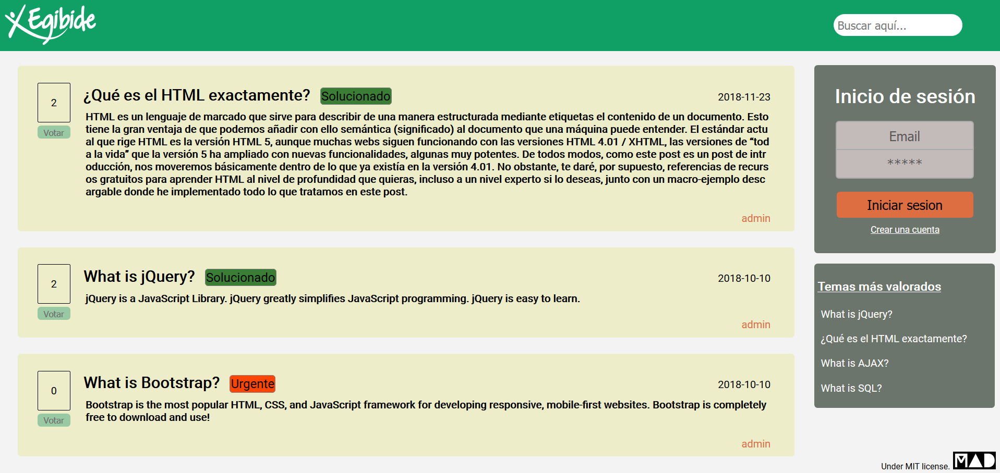
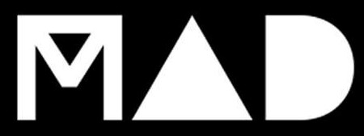

<h1 align="center">Codename Skuld</h1>
<h3 align="center">Foro privado para empresas</h3>

## ¿Qué es?
Un canal privado de preguntas y respuestas para empresas, con facil despliegue y customización que permitirá a tu empresa ir un paso más alla incrementando la colaboración entre equipos y la resolución de problemas.

## Instalación
Disponemos de un tutorial para usuarios (**[vídeo](Documentacion/Manual%20de%20usuario.mp4?raw=true)**) que muestra como instalar y usar la aplicación desde una cuenta existente o nueva de usuario. Se puede descargar el ejecutable .jar comprimido desde **[aquí.](/App/UDA_App.zip?raw=true)**

## Cómo desplegar la aplicación para su desarrollo
Necesitaremos XAMPP para su despliegue.
 

**Lo primero:** Iniciamos el modulo de mysql de XAMPP y nos dirigimos a "PHP my admin" y ejecutamos los scripts SQL que se encuentran en "Base de datos".
 
**Lo segundo:** Configuramos la carpeta htdocs en XAMPP para redireccionar a donde se encuentra el proyecto. Iniciamos el módulo de apache y nos metemos en /localhost.

## Capturas de pantalla  

<h6 align="center">Pantalla de inicio</h6>

## Documentación
**Documentación del proyecto [link](Documentacion/Documentación.pdf)** 

   

 

###### Realizado por MAD project bajo licencia [MIT](LICENSE). 2018.
